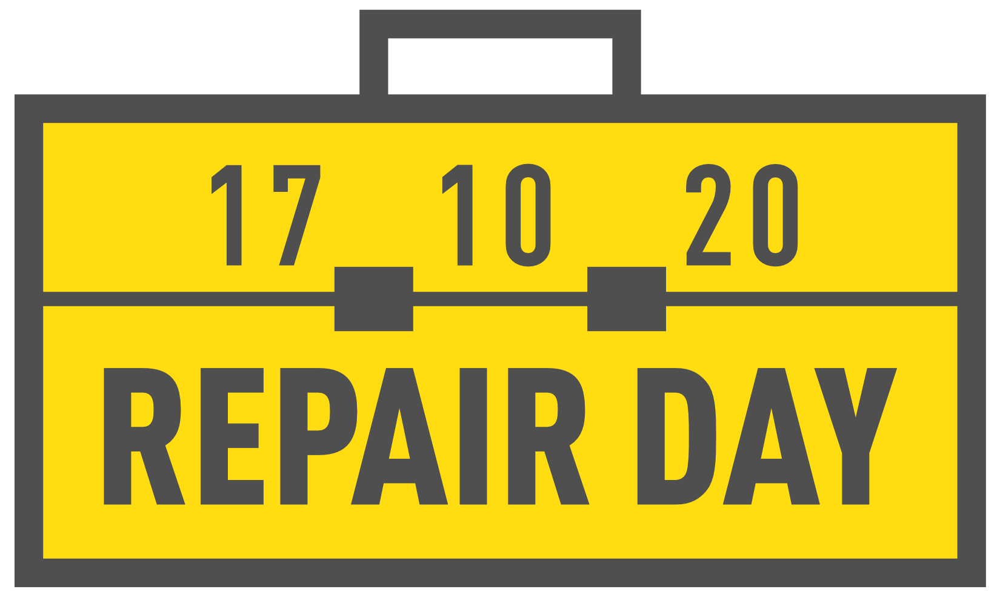

Sehr geehrte Damen und Herren,

im Anhang senden wir Ihnen eine Pressemitteilung zum vierten Internationalen Tag für Reparatur am 17. Oktober 2020.  
Weiterhin ein Bild zur redaktionellen Verwendung auf denen folgende Personen, von links nach rechts zu sehen sind: Leon Farchau, Silke Niermann, Michael Prange.

Wir freuen uns über Erwähnung in jeder Form.

Herzliche Grüße

Michael Prange

Makerspace Gütersloh e.V.  
\- Vorstand -

c/o Die Weberei - Bürgerkiez gGmbH  
Bogenstraße 1-8  
33330 Gütersloh  
info@makerspace-gt.de  
05241-2249910  
Weitere Informationen unter www.makerspace-gt.de

---

## Reparieren ist entscheidend
### Repair Café am Internationalen Tag für Reparatur in der Stadtbibliothek Gütersloh

(Gütersloh) Die vom Verein Makerspace Gütersloh gegründete Reparatur-Initiative nimmt den Internationalen Tag für Reparatur zum Anlass, ihr 17. Repair Café im Digitalen Werkraum der Stadtbibliothek Gütersloh zu veranstalten. In der Zeit von 11:00 bis 14:00 Uhr setzen sie damit bewusst ein Zeichen gegen die Wegwerfgesellschaft und für einen schonenden Umgang mit Ressourcen.

Aktuell leben die Menschen in einer Zeit, in der Abstand halten Leben rettet, Lieferketten unterbrochen sind und sich einige den Kauf neuer Gegenstände nicht mehr leisten können. Außerdem waren in diesem Jahr die Reparatur-Möglichkeiten besonders eingeschränkt. Reparaturbetriebe mussten in vielen Ländern schließen, da sie nicht zu den systemrelevanten Berufen gezählt wurden. Reparieren ist daher entscheidend: Mehr denn je sind die Menschen darauf angewiesen, wiederzuverwenden, was bereits vorhanden ist: „Wir unterstützen die Gütersloher dabei, defekte Gegenstände zu untersuchen und zu reparieren. Dafür stellen wir unser Werkzeug und Know-how bereit", erzählt Michael Prange, Initiator der Veranstaltungsreihe. „Der digitale Werkraum ist ein idealer Veranstaltungsort, da er barrierefrei erreichbar ist und genügend Platz mit Licht und Strom bietet“, ergänzt Bibliotheksleiterin Silke Niermann. 

Im Schnitt werden 10 bis 20 Gegenstände aus den Bereichen Mechanik, Elektronik und Computer während des Repair Cafés zur Reparatur mitgebracht. „Es ist interessant zu untersuchen, wie Geräte funktionieren und sich reparieren lassen", erzählt Leon Farchau, Gründungsmitglied des Makerspace. Gemeinsam lässt sich das meistens noch besser herausfinden, sodass alle Beteiligten ständig etwas dazulernen.  
Eine Anmeldung ist erforderlich – per E-Mail (repair@makerspace-gt.de) oder per Telefon (05241-2249910) – aus Coronaschutz-Gründen und um Wartezeiten zu vermeiden.

  
Michael Prange und Leon Farchau, Makerspace Gütersloh, freuen mit Silke Niermann, Bibliotheksleiterin, auf das 17. Repair Café in der Stadtbibliothek Gütersloh am 4. Internationalen Tag für Reparatur, Samstag, 17.10.2020 von 11-14 Uhr.

---

