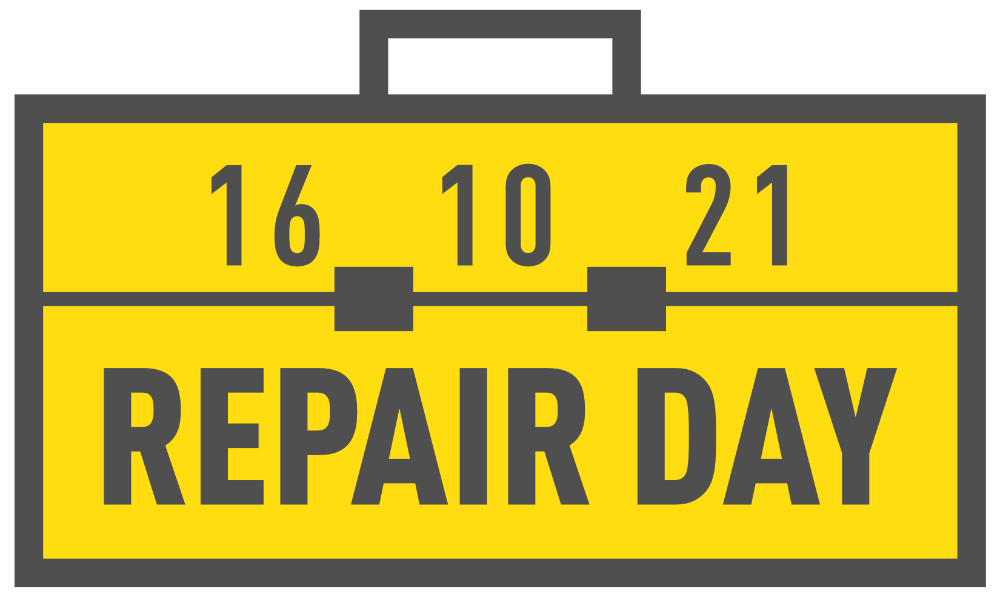

Sehr geehrte Damen und Herren,

im Anhang senden wir Ihnen eine Pressemitteilung zum fünften Internationalen Tag für Reparatur am 16. Oktober 2021.  
Weiterhin ein Bild zur redaktionellen Verwendung auf denen folgende Personen, von links nach rechts zu sehen sind: Philp Markus, Tim Lakämper, Cord Beermann, Sarah Franke, Leon Farchau.

Wir freuen uns über Erwähnung in jeder Form.

Herzliche Grüße

Michael Prange

Makerspace Gütersloh e.V.  
-- Vorstand --

c/o Die Weberei - Bürgerkiez gGmbH  
Bogenstraße 1-8  
33330 Gütersloh  
info@makerspace-gt.de  
05241-2249910  
Weitere Informationen unter www.makerspace-gt.de

---

## Reparieren senkt die Kohlenstoffemissionen
### Repair Café am Internationalen Tag für Reparatur in der Stadtbibliothek Gütersloh

(Gütersloh) Die vom Verein Makerspace Gütersloh gegründete Reparatur-Initiative nimmt den Internationalen Tag für Reparatur zum Anlass, ihr 20. Repair Café im Digitalen Werkraum der Stadtbibliothek Gütersloh zu veranstalten. In der Zeit von 11:00 bis 14:00 Uhr setzen sie damit bewusst ein Zeichen gegen die Wegwerfgesellschaft und für einen schonenden Umgang mit Ressourcen.

Das Motto des Internationalen Tag für Reparatur 2021 lautet "Reparieren senkt die Kohlenstoffemissionen", als Reaktion auf den jüngsten, alarmierenden IPCC-Klimabericht und im Vorfeld der UN-Klimaverhandlungen im November. Bei den meisten Produkten, die zu Gemeinschaftsveranstaltungen mitgebracht oder in Werkstätten repariert werden, entsteht der größte Teil der Umweltbelastung bei der Herstellung - bevor sie überhaupt benutzt werden. Professionelle Reparateure reparieren jeden Tag viele, viele Geräte, die sonst weggeworfen und ersetzt werden würden. Es ist von entscheidender Bedeutung, unsere Reparaturgemeinschaft sowohl bei Reparaturveranstaltungen als auch über lokale Unternehmen zu unterstützen. "Wir unterstützen die Gütersloher dabei, defekte Gegenstände zu untersuchen und zu reparieren. Dafür stellen wir unser Werkzeug und Know-how bereit", erzählt Michael Prange, Initiator der Veranstaltungsreihe. "Der digitale Werkraum ist ein idealer Veranstaltungsort, da er barrierefrei erreichbar ist und genügend Platz mit Licht und Strom bietet", ergänzt Bibliotheksleiterin Silke Niermann. 

Im Schnitt werden 10 bis 20 Gegenstände aus den Bereichen Mechanik, Elektronik und Computer während des Repair Cafés zur Reparatur mitgebracht. „Es ist interessant zu untersuchen, wie Geräte funktionieren und sich reparieren lassen", erzählt Leon Farchau, Gründungsmitglied des Makerspace. Gemeinsam lässt sich das meistens noch besser herausfinden, sodass alle Beteiligten ständig etwas dazulernen.  
Eine Anmeldung ist erforderlich (repair@makerspace-gt.de oder 05241-2249910).

  
Philp Markus, Tim Lakämper, Cord Beermann, Sarah Franke und Leon Farchau sagen "Einfach machen!" zum 20. Repair Café in der Stadtbibliothek Gütersloh am 5. Internationalen Tag für Reparatur, Samstag, 16.10.2020 von 11-14 Uhr.

---

