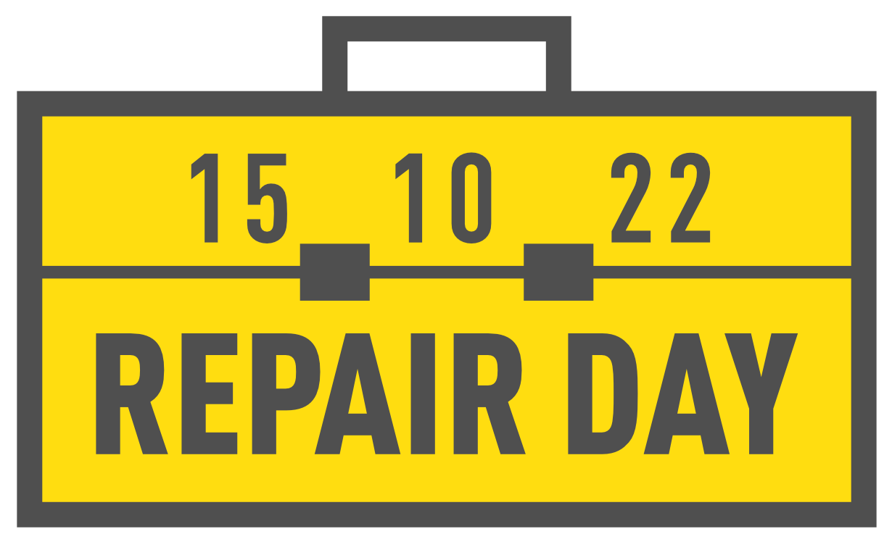

Sehr geehrte Damen und Herren,

## Internationaler Tag für Reparatur

(Gütersloh) Der Verein Makerspace veranstaltet am Samstag, den 15. Oktober 2022 anlässlich des sechsten Internationaler Tag für Reparatur, von 11 bis 14 Uhr ein Repair Café in der Stadtbibliothek. Engagierte stehen mit Wissen und Werkzeug bereit um defekte Haushaltsgegenstände zu untersuchen und diese, wenn möglich, gemeinsam zu reparieren. Eine Anmeldung ist erforderlich (repair@makerspace-gt.de oder 05241-2249910).

---

Wir freuen uns über Erwähnung in jeder Form.

Herzliche Grüße

Makerspace Gütersloh e.V.

c/o Die Weberei - Bürgerkiez gGmbH  
Bogenstraße 1-8  
33330 Gütersloh  
repair@makerspace-gt.de  
05241-2249910  
Weitere Informationen unter www.makerspace-gt.de

---

